# Keyboard Layers

- [Base Layer Diagram Colemak](#base-layer-diagram-colemak)
- [Base Layer Diagram Dvorak](#base-layer-diagram-dvorak)
- [Base Layer Diagram Enthium](#base-layer-diagram-enthium)
- [Base Layer Diagram QWERTY](#base-layer-diagram-qwerty)
- [Base Layer Diagram](#base-layer-diagram)
- [Cursor Layer Diagram](#cursor-layer-diagram)
- [Emoji Layer Diagram](#emoji-layer-diagram)
- [Factory Layer Diagram](#factory-layer-diagram)
- [Function Layer Diagram](#function-layer-diagram)
- [Gaming Layer Diagram](#gaming-layer-diagram)
- [Lower Layer Diagram](#lower-layer-diagram)
- [Magic Layer Diagram](#magic-layer-diagram)
- [Mouse Layer Diagram](#mouse-layer-diagram)
- [Number Layer Diagram](#number-layer-diagram)
- [Symbol Layer Diagram](#symbol-layer-diagram)
- [System Layer Diagram](#system-layer-diagram)
- [Typing Layer Diagram](#typing-layer-diagram)
- [World Layer Diagram](#world-layer-diagram)

## Base Layer Diagram Colemak

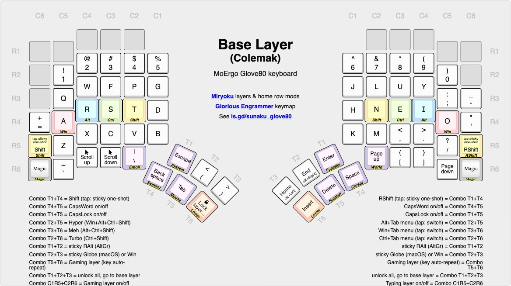

## Base Layer Diagram Dvorak

## Base Layer Diagram Enthium

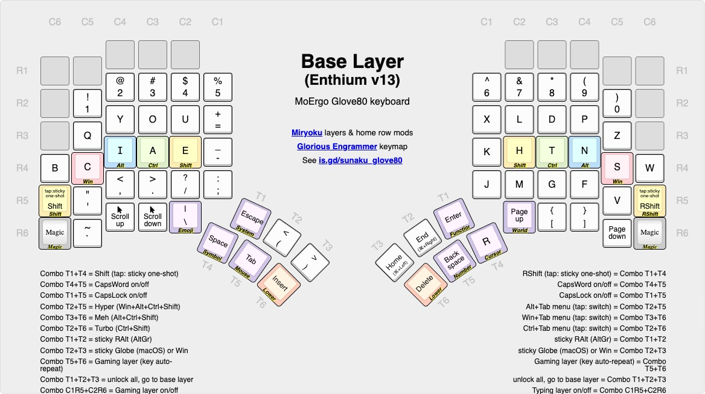

## Base Layer Diagram QWERTY

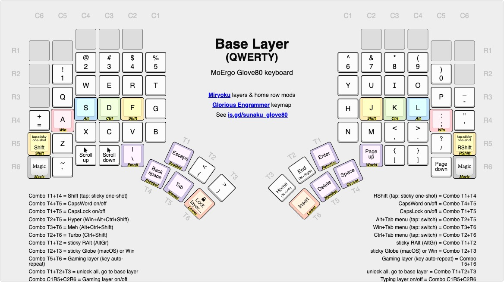

## Base Layer Diagram

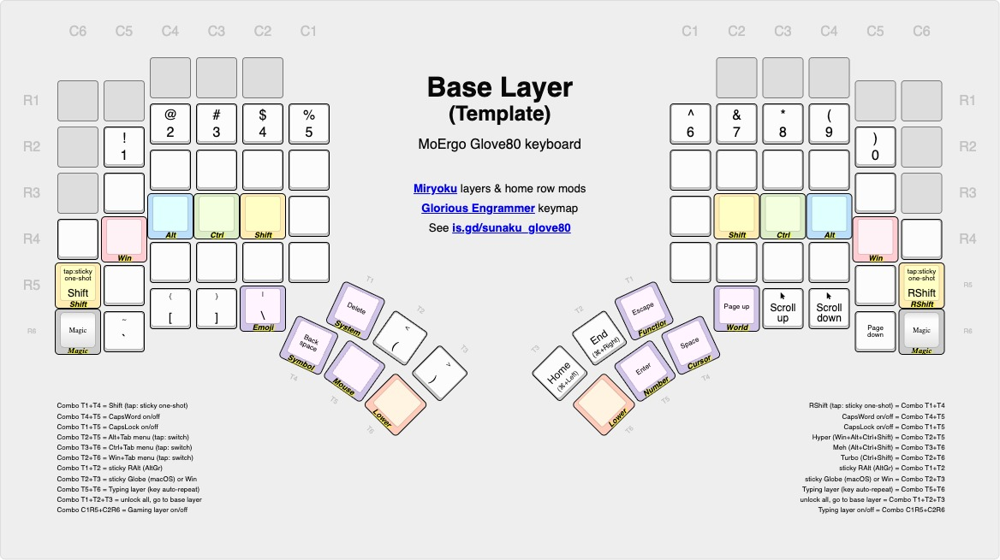

## Cursor Layer Diagram

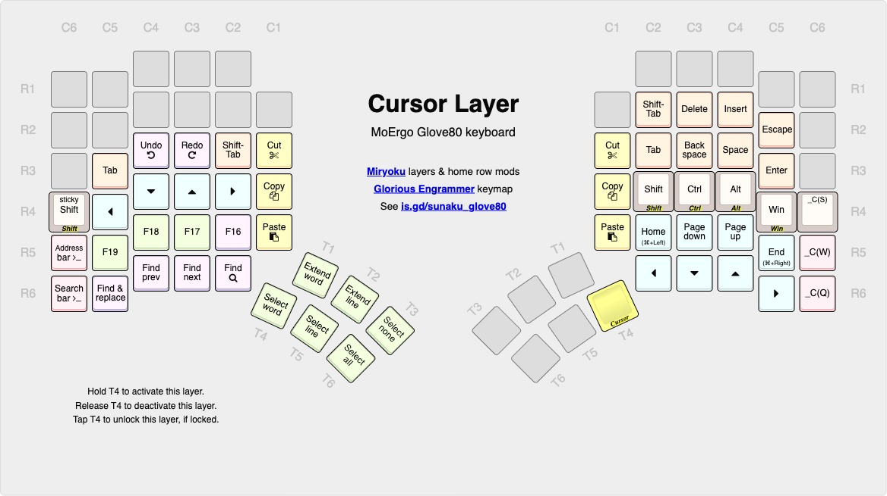

## Emoji Layer Diagram

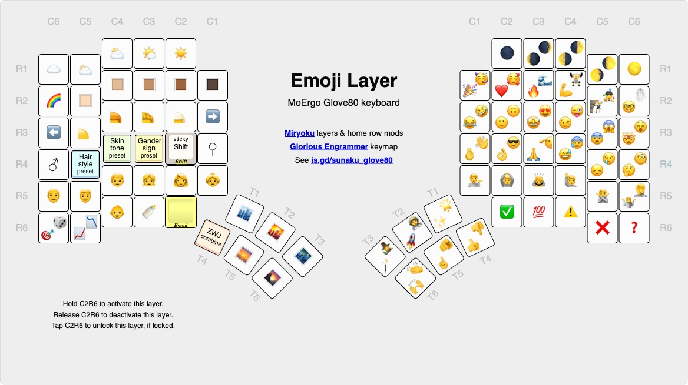

## Factory Layer Diagram

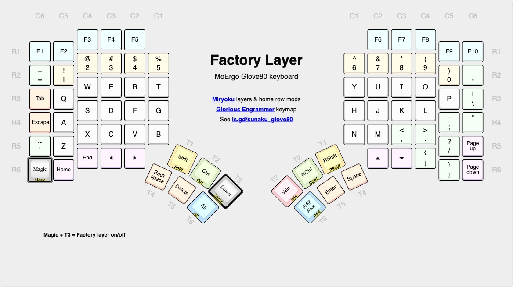

## Function Layer Diagram

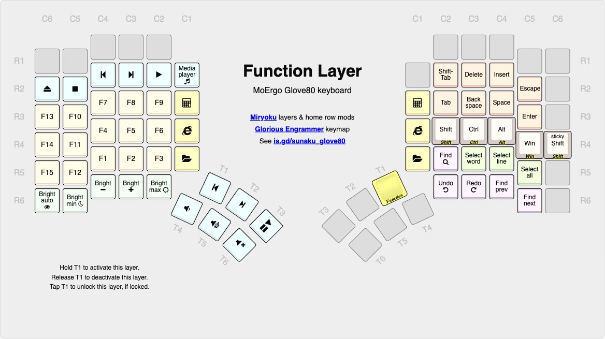

## Gaming Layer Diagram

## Lower Layer Diagram

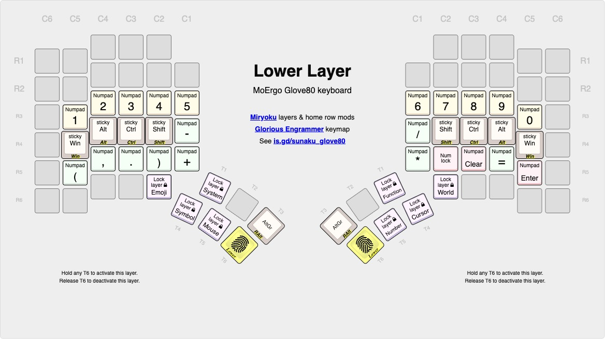

## Magic Layer Diagram

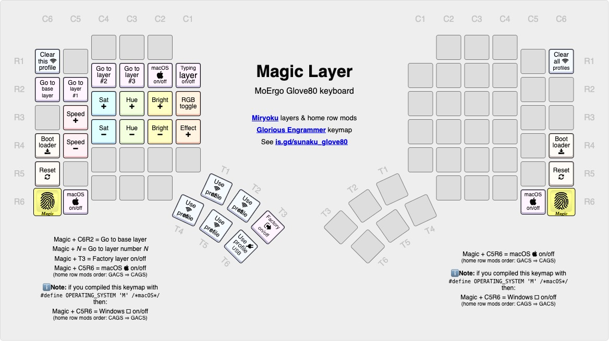

## Mouse Layer Diagram

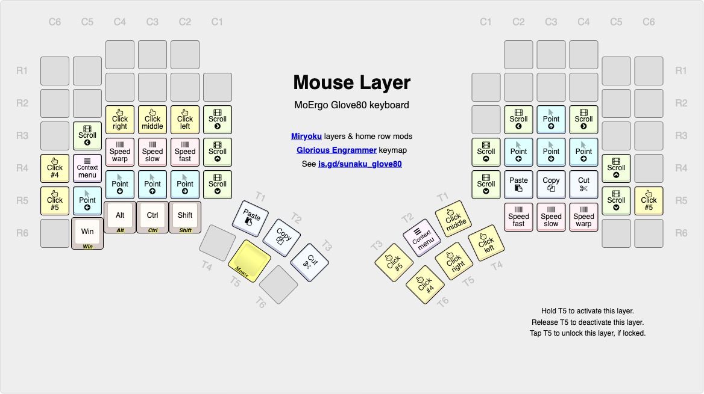

## Number Layer Diagram

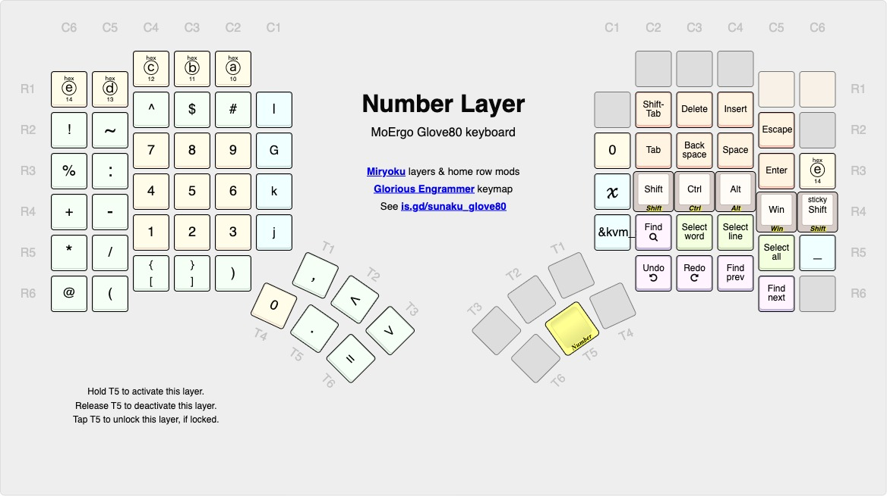

## Symbol Layer Diagram

## System Layer Diagram

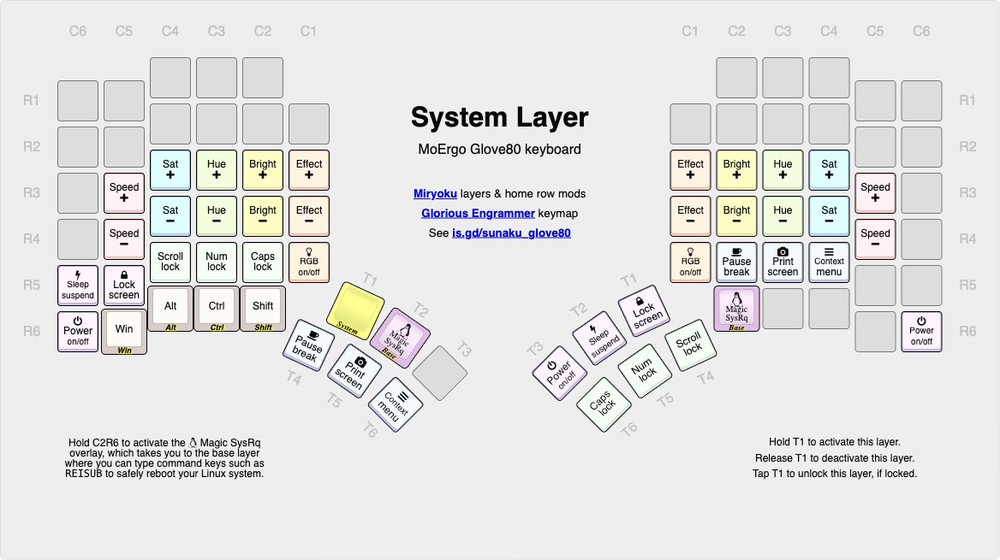

## Typing Layer Diagram

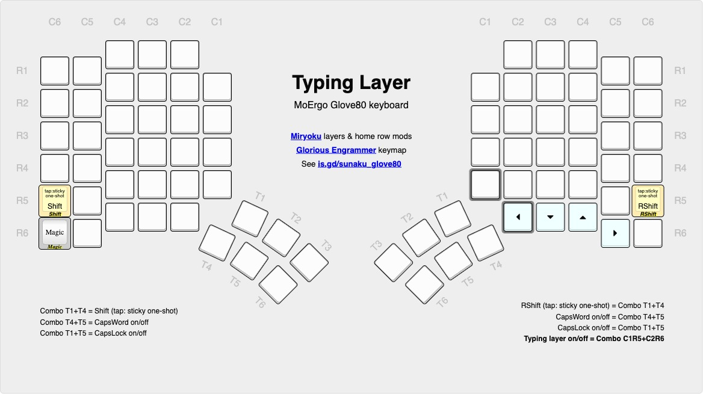

## World Layer Diagram

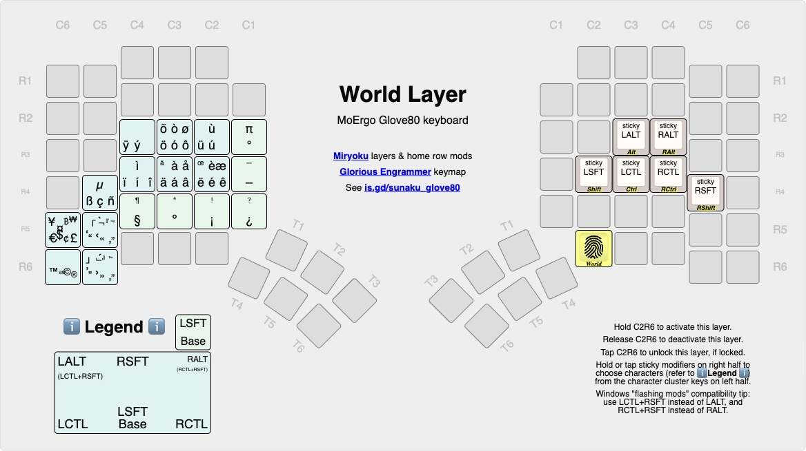